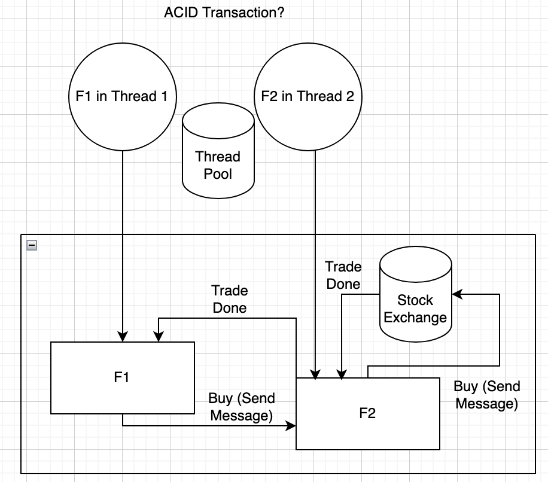

### 📖 Akka Betting House

<ul style="list-style-type:disc">
  <ul>
    <li>✅ <b>Cloud-Native Spring Boot and Akka Development Environment and Startup Template</b>
    <li>✅ <b>Concurrency and Resiliency Patterns in Saga Transactions for Spring Boot and Akka Microservices</b>
    <li>✅ <b>Part 5: Reliable Long-Running Saga Business Processes</b>
    <li>✅ <b>Reactive, Scalable, Persistent, Concurrent and Resilient Actor System with Akka Event Sourcing Framework</b>
    <li>✅ <b>Kafka Dynamic Transaction Processing Queues for Long-Running Saga Business Processes</b>
  </ul>
</ul>

<ul style="list-style-type:disc">
  <li>📖 This <b>Cloud-Native Full-Stack Developer Template</b> provides fully functional Development and Production Environment with Akka Cluster, Kafka Cluster and Spring Boot Microservices deployed to Kubernetes Cluster</li>
    <li>📖 <b>Swagger UI</b> REST API Gateway</li>
    <li>📖 <b>Spring Cloud Gateway</b> with Spring Security and Keycloak Authorization Server</li>
    <li>📖 <b>Event-Sourcing Framework</b> based on Reactive, Concurrent, Scalable and Persistent Akka Actor System</li>
    <li>📖 <b>Akka Actor System</b> with gRPC and REST API Server</li>
    <li>📖 <b>Kafka Cluster</b> integrated with Akka Actor System</li>
    <li>📖 <b>Long Running Saga Business Process Management Framework</b> based on Akka Actor System State Machine and Kafka Dynamic Topics</li>
    <li>📖 <b>Spring Boot Microservices</b> integrated with Akka Actor System as gRPC and REST API Clients</li>
    <li>📖 <b>Spring Boot gRPC Client</b> with Protobuf Maven Plugin</li>
    <li>📖 <b>Spring Cloud OpenFeign REST API Client</b></li>
    <li>📖 <b>Postgresql</b> persistence storage for Akka Actor Environment</li>
    <li>📖 <b>E2E Concurrency and Resiliency Tests</b> with Spring Boot, Kafka UI, Spring JDBC and Spring Cloud OpenFeign REST API Client</li>
    <li>📖 <b>Keycloak Authorization Server</b> integrated with Swagger UI and Spring Security</li>
    <li>📖 <b>Reactive and Event-Driven Programming Paradigm</b> based on Akka Actor System State Machine and Scala Programming Language</li>
    <li>📖 Local <b>Kubernetes</b> Development Environment with <b>Skaffold</b></li>
    <li>📖 Production <b>Kubernetes</b> Development Environment with <b>Skaffold</b> (work in progress)</li>
    <li>📖 <b>Github Actions</b> CI/CD <b>GitOps</b> pipeline (work in progress)</li>
    <li>📖 <b>Azure Terraform</b> Infrastructure with <b>AKS Kubernetes Cluster</b> and <b>Private Container Registry</b> (work in progress)</li>
  <li>📖 Full <b>Technology Stack</b>:</li>
  <ul>
    <li>✅ <b>Swagger UI</b></li>  
    <li>✅ <b>Spring Cloud Gateway</b></li>
    <li>✅ <b>Kafka Kubernetes Cluster with Strimzi Operator</b></li>
    <li>✅ <b>Akka Kubernetes Cluster</b></li>
    <li>✅ <b>Event-Driven Microservices with Spring Boot, Akka Actor System, Kafka and PostgreSQL</b></li>     
    <li>✅ <b>Event-Sourcing Persistence with Akka Actor System, Kafka and PostgreSQL</b></li>
    <li>✅ <b>E2E Concurrency and Resiliency Tests with Spring Boot, Kafka UI, Spring JDBC and Spring Cloud OpenFeign REST API Client</b></li>
    <li>✅ <b>Keycloak Authorization Server</b></li>
    <li>✅ <b>Terraform</b> (work in progress)</li>
    <li>✅ <b>Kubernetes</b></li>
    <li>✅ <b>Github Actions</b> (work in progress)</li>
    <li>✅ <b>Github Secrets and envsubst Environment Variables parser</b> (work in progress)</li>
    <li>✅ <b>Kubernetes Secrets and Configmap Variables</b> (work in progress)</li>
    <li>✅ <b>Local Kubernetes Development Environment with Skaffold</b></li>
    <li>✅ <b>Production Kubernetes Development Environment with Skaffold</b> (work in progress)</li>
    <li>✅ <b>Custom Kubernetes Manifest Generation for Local and Production Environments with sh scripts</b></li>
    <li>✅ <b>Custom Skaffold Manifest Generation for Local and Production Environments with sh scripts</b></li>
    <li>✅ <b>Hot reload of Docker Containers for Local and Production Environments with Skaffold</b></li>
  </ul>
</ul>

### 📖 Links

- `Akka in Action, Second Edition` Book with `Akka Betting House` example: https://www.manning.com/books/akka-in-action-second-edition
- `Fault Tolerance in Akka`: https://freecontent.manning.com/fault-tolerance-in-akka/
- `Concurrency and Resiliency Patterns in Saga Transactions for Spring Boot Microservices, Parts 1-4`: https://www.linkedin.com/posts/michaelsklyar_concurrency-and-resiliency-patterns-in-activity-7168742915765059586-irvJ 


### 📖 Step By Step Guide

#### Step-01: Prepare Your Github Account (optional, only for production CD Environment)

- make sure you have your own Github Account

#### Step 02 - Create New Github Repository (optional, only for production CD Environment)

- Clone this repository and copy the source code to your new repository

#### Step-03: Prepare Your Azure Account (optional, only for production Environment)

- make sure you have your own Azure Account with enough permissions (Sign Up for a Free Trial, if you don't have one)

#### Step-04: Prepare Source Code and Github Actions Workflow  (work in progress, optional, only for production CD Environment):

- Edit "**.github/workflows/deploy-*.yaml**" files: replace "**master**" with the name of your main branch (you can change default main branch name in github repository settings)

- Edit "**k8s/prod/ingress-srv.yaml**" file: replace "**skycomposer.net**" with the name of your registered domain (see **Step-05**  and **Azure Production Environment Setup** for more details)

#### Step-05: Register your domain (optional, only for production Environment):

- You need a registered domain to provide TLS connection with trusted Certificate Authority.

- For more details on setting up TLS on AKS Ingress with LetsEncrypt see this article: https://medium.com/@jainchirag8001/tls-on-aks-ingress-with-letsencrypt-f42d65725a3
This article will show you how to configure TLS on Azure Kubernetes Cluster with LetsEncrypt for any registered domain, including AWS Route 53.

- Make sure that you know how to create Hosted Zone and Record A for your domain provider.

- For more details, see `Azure Production Environment Setup`

#### Step-06: Read the book "Akka in Action, Second Edition" and try out examples from this book (if you want to learn more about Akka Actor System and "Akka Betting House" example):

- If you have further questions about Akka Actor System and "Akka Betting House", refer to this book: https://www.manning.com/books/akka-in-action-second-edition
- I strongly recommend you finish this book, before following this guide!
- This guide will only help you deploy the environment to local or azure cloud kubernetes cluster, enable github actions cd pipeline (work in progress) and configure local and production kubernetes development environment with skaffold
- All information about Akka Actor System, Scala Development, Akka Event-Sourcing State Machine, Aka Scalable and Persistent Cluster and "Akka Betting House" example, is greatly explained in this book!
- "Skyglass Akka Betting House" repository is based on the example from the book and further developed to implement the Long-Running Saga Business Process of Bet Settlement with Akka Persistent State Machine and Kafka Dynamic Transaction Processing Queues
- "Skyglass Akka Betting House" repository also contains additional examples of Scalability, Concurrency, Resilience, Event-Sourcing, State Management, Long-Running Saga Business Processes, Idempotent Consumers and Retryable Error Handling based on "Akka Betting House" Business Domain

### Local Kubernetes Environment Setup with Skaffold:

- Create local Kubernetes Cluster. If you have Docker Desktop, just go to Settings -> Kubernetes -> Enable Kubernetes ->  Apply & Restart

- Switch context to local Kubernetes Cluster. If you have Docker Desktop, just go to Kubernetes Context and select "docker-desktop"

```
helm repo add ingress-nginx https://kubernetes.github.io/ingress-nginx
helm repo update
kubectl apply -f https://raw.githubusercontent.com/kubernetes/ingress-nginx/controller-v1.4.0/deploy/static/provider/cloud/deploy.yaml
```
These commands will install nginx ingress controller to your local kubernetes cluster. You need nginx ingress controller for your local kubernetes ingress resource to work correctly (see `k8s/local/ingress-srv.yaml`for more information on your local kubernetes ingress resource)

- create `env` folder in the root of the project

- create `.env.local` file in `env` folder and provide the following parameters:

```
CONTAINER_REGISTRY="bettinghouse.azurecr.io" (for local environment you can keep this name, for production environment provide your own container registry, see **Azure Production Environment Setup** for more details)
DOCKER_FILE_NAME="Dockerfile"
DOCKER_PUSH="false"
VERSION="latest"
BASE_URL="http://ingress-nginx-controller.ingress-nginx.svc.cluster.local"
```

- Don't Panic! `env` folder is included to .gitignore. You will not reveal your secrets with git commit! :)
- Note: CONTAINER_REGISTRY for local development environment can be any prefix, but it is recommended to use container registry name for consistency with production environment
- BASE_URL for local kubernetes cluster uses ingress-nginx service ip. Please, don't change it! If your nginx-ingress controller is installed correctly, this url will work as expected.

```
sh skaffold-local.sh
```
This script will build docker images and start local kubernetes environment with hot reloading of your code changes

- open `localhost` in your Browser and make sure that `Sign Up` and `Sign In` works, you are able to `Create a Ticket` and buy it

- optionally, create 2 test accounts, create ticket with one account and buy ticket with another account

- Use "magic" payment card with number 4242 4242 4242 4242 for unlimited payment. :)

- If the payment is sucessful, you will see your order with status `complete` in `Orders` tab

- Note: if the payment is successfull, you will not see ticket in `Tickets` tab anymore! All tickets in this app have a quantity of one! It means that only one user can buy a ticket! You can test concurrency control by trying to buy the same ticket with several users. First user will succeed, others will fail to buy a ticket!

- Congratulations! You successfuly tested `Ticketing App` locally!


## Azure Production Kubernetes Environment Setup with Skaffold:

- create `terraform.auto.tfvars` file in `infra` folder and provide following parameters:

```
kubernetes_version= "1.29.2"
app_name = "{provide_your_own_globally_unique_name}" 
location = "westeurope" (use any other azure location, for example, "germanywestcentral", if you have any issues with "westeurope")
```

- login to Azure Cloud with `az login` CLI

- cd to `infra` folder

- replace `bettinghouse` with your own globally unique name (see files `container-registry.tf`, `kubernetes-cluster.tf` and `resource-group.tf`)

- run `terraform init`and `terraform apply --auto-approve`

- after the script is successfully finished, run the following command:

```
az aks get-credentials --resource-group {app_name} --name {app_name}
```

- Make sure that your context is switched from local Kubernetes Cluster to Azure Kubernetes Cluster. If you have Docker Desktop, just open Kubernetes Context and make sure that the name of the context corresponds to your Azure Kubernetes Cluster

- run `kubectl get pods` and make sure that `kubectl` works correctly and returns 0 resources

- login to Azure Container registry with the following command:

```
docker login {login_server}
```

- you can find docker login server, username and password in Azure Cloud (go to Container Registry -> Settings -> Access Keys)

- create `env` folder in the root of the project

- in `env` folder create `.env.prod` file and set the following environment variables:

```
CONTAINER_REGISTRY="bettinghouse.azurecr.io"  (provide your own globally unique container registry)
DOCKER_FILE_NAME="Dockerfile-prod"
DOCKER_PUSH="true"
VERSION="latest"
BASE_URL="https://skycomposer.net" (provide your own domain name, see `Step-05` and notes below for more details)

JWT_KEY="$JWT_KEY"
STRIPE_KEY="$STRIPE_KEY"
```

- Don't Panic! `env` folder is included to .gitignore. You will not reveal your secrets with git commit! :)
- Make sure you set your own values for CONTAINER_REGISTRY, BASE_URL, JWT_KEY and STRIPE_KEY
- JWT_KEY can be generated with the command `openssl rand -base64 32`
- STRIPE_KEY can be found in your Stripe Account (Developers -> API Keys -> Secret Key ->  Reveal test key)
 
- register your domain and enable TLS on AKS Ingress with Lestencrypt: https://medium.com/@jainchirag8001/tls-on-aks-ingress-with-letsencrypt-f42d65725a3
- Make sure you provide your email for CA cluster issuer Kubernetes resource (see more details in the article)
- Make sure you installed ingress controller with helm (see more details in the article)
- Make sure you installed all other kubernetes resources and followed other instructions in the article
- You can find production Ingress Kubernetes Resource in `k8s/prod/ingress-srv.yaml`. This resource will be applied with `skaffold-prod.sh` or `skaffold-dev.sh` scripts. Make sure that you replaced `skycomposer.net` with your registered domain name

- run `sh skaffold-dev.sh`

- this script will build docker images, push them to azure container registry and deploy images to production kubernetes cluster with hot reloading of your code changes

- run `kubectl get pods` and make sure that all containers are RUNNING

- open https url with your registered domain in your Browser and make sure that `Sign Up` and `Sign In` works, you are able to `Create a Ticket` and buy it

- optionally, create 2 test accounts, create ticket with one account and buy ticket with another account

- Use "magic" payment card with number 4242 4242 4242 4242 for unlimited payment. :)

- If the payment is sucessful, you will see your order with status `complete` in `Orders` tab

- Note: if the payment is successfull, you will not see ticket in `Tickets` tab anymore! All tickets in this app have a quantity of one! It means that only one user can buy a ticket! You can test concurrency control by trying to buy the same ticket with several users. First user will succeed, others will fail to buy a ticket!

- Congratulations! You successfuly tested `Ticketing App` in production!

- run `sh skaffold-prod.sh` to deploy final changes to production

- The only difference between `sh skaffold-prod.sh` and `sh skaffold-dev.sh` is that `sh skaffold-dev.sh` allows hot reloading of your code changes on production! Try to make any code change with your IDE and you will immediately see this change on production!

- If you run `sh skaffold-dev.sh` you will see logs in real-time. After closing the cli window, all kubernetes resources will be destroyed! Therefore, in order to deploy final changes to production use `sh skaffold-prod.sh`. You will not have hot reloading with `sh skaffold-prod.sh`, but kubernetes resources will not be destroyed after you close cli window.

### Github Actions Deployment Pipeline Setup

- create the following Github Secrets (Go to Your Repository -> Settings -> Secrets and Variables -> Actions -> New Repository Secret):

```
CONTAINER_REGISTRY=... (Azure Container Registry)
KUBE_CONFIG=.. (Base64 encoded  ~/.kube/config file contents)
REGISTRY_UN=... (Azure Container Registry Username)
REGISTRY_PW=... (Azure Container Registry Password)
```

- you can find values for CONTAINER_REGISTRY, REGISTRY_UN and REGISTRY_PW in Azure Cloud (go to Container Registry -> Settings -> Access Keys)
- you can get the value of KUBE_CONFIG with this command `cat ~/.kube/config | base64` (make sure you switched context to Azure Production Kubernetes Cluster before running this command!)

- make any code changes (for example change `SkyComposer` to `SkyComposer 2` in `client/components/header.js` file)

- push changes with `git add .`, `git commit -m "test changes"`and `git push origin`

- go to "Your repository -> Actions" and make sure that the Deployment Pipeline is automatically started and successfully finished

- this pipeline will build changed docker image, push it to container registry and deploy changed image with new version to kubernetes cluster

- open https link for your registered domain in your Browser and make sure that you can see `SkyComposer 2` title on the top left

- Congratulations! You successfuly tested `Ticketing App` code changes with Github Actions Deployment Pipeline!


# 📖 Akka Actor System Overview


<ul style="list-style-type:disc">
  <ul>
    <li>✅ <b>Classic Programming Paradigm deals with blocking I/O operations inefficiently using thread resources</b>
    <li>✅ <b>While waiting for the response, thread is waiting blocked, without doing any useful work</b>
    <li>✅ <b>More efficient resource usage would be sending request, without waiting for response, and be notified about the response</b>
    <li>✅ <b>Reactive Programming is a variation of Observer Pattern, when thread sends request and then notified about the response later</b>
    <li>✅ <b>Reactive Frameworks allow thread to continue after sending the request and handle another queued job, while waiting for the response</b>
    <li>✅ <b>But Reactive programming paradigm, despite its power, has a lot of challenges</b>
    <li>✅ <b>With Classic programming paradigm blocks of code are executed synchronously and sequentially</b>
    <li>✅ <b>With Classic programming paradigm ACID transactions are easy to implement</b>
    <li>✅ <b>But with Reactive Programming synchronous and sequential execution is challenging and even if possible doesn't provide any advantages, because in the end you end up with the same blocking operation</b>
    <li>✅ <b>With Reactive Programming you write event-driven functional handlers without any idea on which thread and in which context they will be executed</b>
    <li>✅ <b>Functional handler F1 might be executed in one thread and then functional handler F2 will be executed in a different thread with different context, possibly even in a different instance of the reactive application</b>
    <li>✅ <b>Event-Driven nature of Reactive Programming fits naturally with Event Sourcing Framework</b>
    <li>✅ <b>Event Sourcing is an alternative to classic ACID Transactions</b>
    <li>✅ <b>Event Sourcing Framework provides eventual consistency by writing append-only events to the durable event storage, which acts as a single source of truth</b>
    <li>✅ <b>Actor Frameworks deal with persistent event sourced micro processes, each with its own ID, state and business logic, also known as Actors</b>
    <li>✅ <b>Any two messages, sent to actor with the same ID must be processed sequentially - Reactive Actor Frameworks guarantee Thread Safety for the Actors with the same ID</b>
    <li>✅ <b>Reactive Actor Frameworks provide efficient resource usage by executing queued Actor Message Handlers in the next available thread from the pool</b>
    <li>✅ <b>Reactive Actor Frameworks allow concurrent event handling for actors with different IDs</b>
    <li>✅ <b>Reactive Actor Frameworks guarantee thread-safety for handling events of actors with the same ID</b>
    <li>✅ <b>In case any application instance crashes, persistent actor state can be restored from the database</b>
    <li>✅ <b>Actor State can be restored by replaying all its events from the beginning, or starting from the latest snapshot</b>
    <li>✅ <b>Akka Actor System is a powerful reactive actor framework, available in Java or Scala, and enabling all of the above-mentioned Actor System capabilities</b>
    <li>✅ <b>Akka Actor System provides Actor persistence, scalability, effective resource usage and strong-typed reactive programming paradigm helping programmers to focus on the business-logic</b>
    <li>✅ <b>Akka Actor System framework provides powerful persistent state machine for each actor and allows to scale Akka Cluster if necessary, in order to deal with millions of actors, each with its own state</b>
    <li>✅ <b>Millions of actors can exist in Akka Cluster Memory. Each Actor has very low memory footprint, in contrast to JVM Threads</b>
    <li>✅ <b>Akka State Machine handles commands, persists events, safely updates its state and prevents from handling events in a wrong state</b>
    <li>✅ <b>Akka Cluster requires persistent storage for storing Event Sourcing Events and Metadata. The list of supported databases: PostgreSQL, Oracle, Microsoft SQL Server, Cassandra</b>
    <li>✅ <b>JDBC and R2DBC plugins enable integration of Akka Event Handlers with JDBC- and R2DBC-compliant databases</b>
    <li>✅ <b>Alpakka plugin enables integration of Akka Event Handlers with Kafka</b>
    <li>✅ <b>Integration of Akka with Kafka enables reliable processing of millions of events</b>
    <li>✅ <b>Akka State Machine integrated with Kafka and Persistent Storage is a powerful combination to build Long-Running Saga Transactions also known as Business Processes</b>
    <li>✅ <b>Each Business Process Instance is an actor of some type, with its own unique ID, state transition business logic and persistent state</b>
    <li>✅ <b>Other Powerful Features of Akka Actors: Context Sharing, Sharding, Actor Hierarchy, Error Handling with Retry, Timeout or Scheduling Events and so on</b>
    <li>✅ <b>Parent Actor can create child  Actors and stop all children, when parent actor stops. Parent actor can also notify all children or children can notify parents</b>
  </ul>
</ul>

